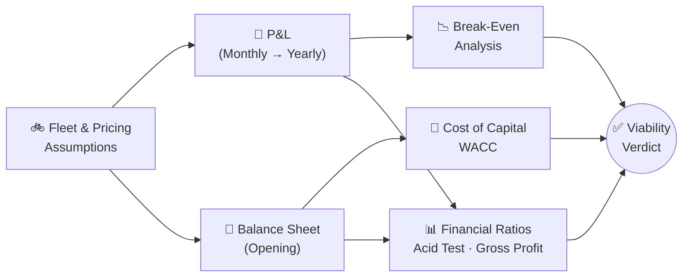
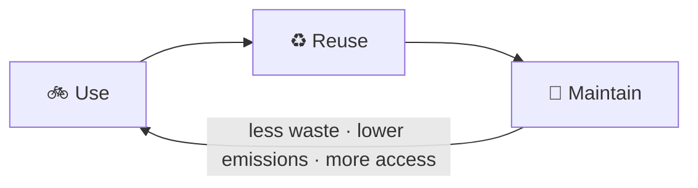

# A Bike-Subscription Business Plan

**Financial Toolbox · Group Assignment (Team 6)**

**MSc International Business Management & Finance**

  
  
  
  

<h3>💭 Can a bike-subscription service turn a profit in a 70,000-student city — and how many subscribers does it need before it does?</h3>

Financial modeling · P&L forecasting · Balance sheet structuring · Cost of Capital (WACC) · Break-even analysis · SWOT

 

| 💰 Profitable? | 🚲 Break-even | 🏦 Financing | 💧 Liquidity | 📈 Margin |
|:---:|:---:|:---:|:---:|:---:|
| ✅ **€15,497**/yr net profit | **152** subs/mo | **WACC 3.94%** | **Acid Test 1.82** | **Gross Profit 81.3%** |

---

## 📂 Contents

- [👥 Team 6](#-team-6)
- [💡 The Idea](#-the-idea)
- [🧮 Key Assumptions](#-key-assumptions)
- [🔄 How the Model Fits Together](#-how-the-model-fits-together)
- [📊 Financial Model & Results](#-financial-model--results)
- [🎯 SWOT Analysis](#-swot-analysis)
- [🌱 Sustainability Check](#-sustainability-check)
- [🖼️ Visuals](#️-visuals)
- [✅ Conclusion](#-conclusion)
- [📁 Repo Contents](#-repo-contents)

---

## 👥 Team 6

| Member | Contribution | |
|---|---|:---:|
| **Jimena Dolores** | Business idea, Swapfiets benchmark, led the SWOT analysis |  |
| **Ludovic Delot** | Slide deck design, financial ratios, revenue plan, assumption research in Excel |  |
| **Carlos Arroyo** | Income statement projections, assumption research, break-even calculation |  |
| **Iñigo Ocampo** | Balance sheet projection, value proposition, support on key ratios |  |
| **Abhishek Prabhakaran** | SWOT refinement, led the Sustainability Check | |
| **Sebastian Ruiz** | Sustainability Check and SWOT, emphasis on the circular model | |

---

## 💡 The Idea

**Easy Velo** is a bike subscription service for **Rennes, France**, benchmarked against [Swapfiets](https://swapfiets.fr/) (founded 2014): for a fixed monthly price, customers get a personal second-hand bike with maintenance, theft insurance, and repairs included — pickup at the store, no paperwork, automatic renewal.

> 🎓 **Why Rennes:** it's a vibrant student city of 70,000 — but the city's public bike program (Vélo STAR, 832 bikes) gives just **2.2 bikes per 1,000 inhabitants**, against a European average of 4/1,000 (EEA). Easy Velo targets that access gap.

> 📋 **The brief** (30% of the course grade): *build a simple business plan and show whether it can make money*, covering the business idea, value proposition, revenue plan, a one-year P&L, two justified financial ratios, a SWOT, a sustainability angle, and a closing pitch. See [`Assignment_Brief.docx`](Assignment_Brief.docx).

## 🧮 Key Assumptions

| Item | Assumption | Source |
|---|---|---|
| 🚲 Fleet | 350 second-hand bikes @ €300/unit (€105,000 total investment) | [Decathlon listing](https://www.decathlon.fr/) |
| 📊 Utilization | 80% of fleet in active subscriptions (280 bikes) | Benchmarked against a reference case study (~67% utilization), adjusted upward for Rennes |
| 💶 Pricing | €15.5/month subscription + €10 one-time onboarding fee | [Swapfiets pricing](https://swapfiets.fr/) (€16.90/month for comparison) |
| 🔧 Maintenance | 5% of active bikes need service/month, €6/bike average cost | — |
| 👷 Staffing | 1 part-time mechanic (€570/mo) + 1 part-time admin (€500/mo) | French minimum wage reference |
| 🏬 Fixed costs | Store rent €1,200/mo, marketing €500/mo, app maintenance €200/mo | Rennes commercial listing |
| 🏦 Financing | €11,000 angel loan + €26,900 savings (equity) + €80,000 bank loan for the fleet | — |
| 📉 Cost of capital | Cost of equity 3.46% (10Y French OAT bond) · Cost of debt 6% (avg. bank rate) · Tax 15% | — |

## 🔄 How the Model Fits Together

## 📊 Financial Model & Results

<table>
<tr><th>Statement</th><th>Key figures</th></tr>
<tr>
<td><b>💵 P&L (monthly → yearly)</b></td>
<td>Total Sales <b>€7,140 → €54,880</b> · COGS €854 → €10,248 · Gross Profit <b>€6,286</b> → €44,632 · OpEx €2,200 → €26,400 · Net Profit <b>€3,473 → €15,497</b></td>
</tr>
<tr>
<td><b>🧾 Balance Sheet (opening)</b></td>
<td>Net Fixed Assets €87,900 (bikes €84,000 + tools/furniture €3,900) · Net Current Assets €30,000 (working capital) · Bank Loan €80,000 · <b>Net Assets / Equity €37,900</b></td>
</tr>
<tr>
<td><b>🏦 Cost of Capital</b></td>
<td>Weight of Debt 29.0% · Weight of Equity 71.0% · <b>WACC = 3.94%</b></td>
</tr>
<tr>
<td><b>📉 Break-even (Year 1)</b></td>
<td>Contribution margin €19.5/subscription (price €25.5 − variable cost €6) on fixed costs of €2,970/month → <b>152 subscriptions</b> (€3,884/month) to break even</td>
</tr>
<tr>
<td><b>📊 Financial ratios</b> (the 2 required by the brief)</td>
<td><b>Acid Test Ratio = 1.82</b> — (Current Assets − Inventory) / Current Liabilities: covers short-term liabilities 1.82× without relying on inventory. <b>Gross Profit Ratio = 81.3%</b> — (Net Sales − COGS) / Net Sales, annual basis: retains €0.81 per €1 of sales after direct costs — strong pricing power.</td>
</tr>
</table>

## 🎯 SWOT Analysis

<table>
<tr><th>💪 Strengths</th><th>⚠️ Weaknesses</th></tr>
<tr><td>

- Competitive pricing aligned with market standards
- High fleet utilization (80%)
- Targeted focus on a high-density student market
- Simple operational model, low logistics complexity
- All-inclusive service, clear sustainability positioning

</td><td>

- High upfront capital requirement (€105k for 350 bikes) → early financial pressure
- Dependence on a single physical location
- Small operational team → risk during peak repair periods

</td></tr>
<tr><th>🌍 Opportunities</th><th>🚨 Threats</th></tr>
<tr><td>

- Large student population in Rennes
- Increasing city-level support for sustainable transport
- Partnership opportunities
- Scalable model for other mid-size university cities
- Seasonal/short-term packages matching student behavior

</td><td>

- Theft and vandalism
- Policy changes on urban mobility / rental regulation / insurance
- Supply chain fluctuations raising bike/spare-part costs

</td></tr>
</table>

## 🌱 Sustainability Check

Easy Velo runs on a **circular model**: subscription instead of one-time sale keeps bikes in a loop instead of a landfill-bound path.

- Lowers CO₂ emissions — a regularly used bike can replace hundreds of short car trips a year.
- Encourages active, zero-emission transport, improving air quality and reducing congestion.
- Extends product life cycles through repair instead of replacement.

## 🖼️ Visuals

<table>
<tr>
<td width="50%">
Monthly P&L bridge — from sales to net profit
</td>
<td width="50%">
Break-even point at 152 active subscriptions
</td>
</tr>
</table>

Charts rendered from the model's own numbers — see <a href="EasyVelo_SlideDeck_Team6.pdf"><code>EasyVelo_SlideDeck_Team6.pdf</code></a> for the team's original slide visuals, including the Swapfiets benchmark and full SWOT layout.

## ✅ Conclusion

The model **supports the idea's viability**: at the planned 80% fleet utilization (280 active subscriptions), Easy Velo sits comfortably above its 152-subscription break-even point, with a healthy net profit and strong gross margin (81.3%) in year 1. The financing mix (mostly equity + a small angel loan, plus a separate bank loan for the fleet itself) keeps the **WACC low at 3.94%**, and the **Acid Test Ratio of 1.82** shows the business can meet short-term obligations comfortably without touching inventory. The real risk lever is **utilization**, not financing cost or liquidity — every point of occupancy below the 80% assumption moves the business meaningfully closer to its break-even line.

⚠️ <b>Limitations</b> (self-critique, from the team's own SWOT)

 

- High upfront capital requirement (€105k for 350 bikes) creates early financial pressure.
- Utilization (80%) is the single most sensitive assumption in the whole model and is benchmarked against one reference case study, not Rennes-specific market data.
- Dependence on a single physical location and a small operational team, which may struggle during peak repair periods or seasonal spikes.
- The €80,000 bank loan is not folded into the WACC calculation (which only weights the €11,000 angel loan against equity) — a fuller model would size WACC against total financing, not just the working-capital piece.
- Operational risks from theft/vandalism, and exposure to urban-mobility policy changes and bike/spare-part supply chain fluctuations.

## 📁 Repo Contents

| File | Description |
|---|---|
| 🎞️ [`EasyVelo_SlideDeck_Team6.pdf`](EasyVelo_SlideDeck_Team6.pdf) | The team's final 11-slide presentation — idea, value proposition, Swapfiets benchmark, revenue plan, income statement, balance sheet, financial ratios, SWOT, sustainability check, individual contributions |
| 📊 [`EasyVelo_Financial_Model_LDELOT.xlsx`](EasyVelo_Financial_Model_LDELOT.xlsx) | Full financial model behind the deck — 5 sheets: Assumptions, P&L, Balance Sheet, Cost of Capital, Break Even |
| 📋 [`Assignment_Brief.docx`](Assignment_Brief.docx) | Official assignment brief (objective, required slide contents, grading weight) |
| 🖼️ `figures/` | P&L bridge and break-even charts (rendered from the model's own figures) |

---

Uploaded by **[Ludovic Delot](https://www.linkedin.com/in/delot/)** 
MSc International Business Management & Finance · [Rennes School of Business](https://www.rennes-sb.com/)

